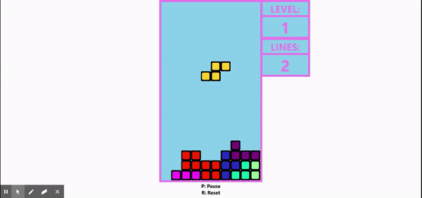

# Notris

Tetromino-based puzzle game created using [React.js](https://facebook.github.io/react/) and [Redux.js](http://redux.js.org/).

## [Play Here](https://notris.netlify.app)

<!-- <video width="320" height="240" controls>
  <source src="notris.mp4" type="video/mp4">
</video> -->

<!--  -->

## Controls

| Key                                   | Action       |
| ------------------------------------- | ------------ |
| A, Left, Numpad4                      | Left         |
| D, Right, Numpad6                     | Right        |
| S, Down, Numpad5, Numpad2             | Soft Drop    |
| Space, Numpad9, NumpadAdd, ShiftRight | Hard Drop    |
| Up, E, Numpad8                        | Rotate Right |
| Z, W, /, Numpad8, NumpadDivide        | Rotate Left  |
| O                                     | Reset        |
| P, K                                  | Pause        |
